# SSL Setup Sequence Diagrams

## Initial SSL Certificate Setup

This diagram shows the complete flow when running `./scripts/setup-ssl.sh` for the first time.


## Automatic Certificate Renewal Process

This diagram shows what happens every 12 hours for automatic certificate renewal.

```mermaid
sequenceDiagram
    participant Certbot as Certbot Container<br/>(Auto-Renewal Loop)
    participant FileSystem as File System
    participant LetsEncrypt as Let's Encrypt CA
    participant Nginx as Nginx Container
    participant User as Browser/User

    Note over Certbot: Every 12 hours...
    Certbot->>Certbot: Wake up from 12h sleep
    Certbot->>FileSystem: Check certificate expiry date

    alt Certificate expires in < 30 days
        Note over Certbot,LetsEncrypt: Renewal Needed
        Certbot->>LetsEncrypt: Request certificate renewal
        LetsEncrypt->>LetsEncrypt: Generate new challenge
        LetsEncrypt->>Certbot: Challenge token

        Certbot->>FileSystem: Write challenge to certbot/www/
        Certbot->>LetsEncrypt: Ready for validation

        LetsEncrypt->>Nginx: GET /.well-known/acme-challenge/TOKEN
        Nginx->>FileSystem: Read challenge file
        FileSystem->>Nginx: Return file
        Nginx->>LetsEncrypt: Challenge response

        LetsEncrypt->>LetsEncrypt: Validate
        LetsEncrypt->>Certbot: ✓ New certificate issued

        Certbot->>FileSystem: Save new fullchain.pem
        Certbot->>FileSystem: Save new privkey.pem

        Note over Nginx: Every 6 hours, Nginx reloads automatically
        Note over Nginx: Next reload will pick up new certificate

    else Certificate still valid (> 30 days)
        Certbot->>Certbot: No renewal needed
    end

    Certbot->>Certbot: Sleep 12h

    Note over User,Nginx: Meanwhile, users continue to access site normally
    User->>Nginx: HTTPS request
    Nginx->>FileSystem: Load SSL certificate
    Nginx->>User: Secure connection ✓
```



## User Request Flow (HTTPS)

This diagram shows what happens when a user visits your site after SSL is configured.


## Container Architecture Diagram

This diagram shows the overall container architecture with SSL.

```mermaid
graph TB
    subgraph Internet
        User[👤 User Browser]
        LetsEncrypt[🔐 Let's Encrypt CA]
    end

    subgraph "Host Server (Ports 80, 443)"
        Nginx[🌐 Nginx Reverse Proxy<br/>Ports: 80, 443]

        subgraph "Internal Network (app-network)"
            App[🎮 Button Smasher App<br/>Port: 3000<br/>Internal only]
            Certbot[🔑 Certbot<br/>Auto-renewal daemon]
        end

        subgraph "Volumes"
            CertConf[(📁 certbot/conf<br/>SSL Certificates)]
            CertWww[(📁 certbot/www<br/>ACME Challenges)]
            NginxConf[(📁 nginx/conf<br/>Nginx Config)]
        end
    end

    User -->|HTTP :80| Nginx
    User -->|HTTPS :443| Nginx
    Nginx -->|Proxy :3000| App

    Nginx -.->|Read config| NginxConf
    Nginx -.->|Read certs| CertConf
    Nginx -.->|Serve ACME| CertWww

    Certbot -.->|Write certs| CertConf
    Certbot -.->|Write challenges| CertWww
    Certbot <-->|Validate| LetsEncrypt
    LetsEncrypt -->|Verify challenges| Nginx

    style User fill:#4A90E2
    style Nginx fill:#50E3C2
    style App fill:#F5A623
    style Certbot fill:#7ED321
    style LetsEncrypt fill:#BD10E0
    style CertConf fill:#D0021B
    style CertWww fill:#D0021B
    style NginxConf fill:#D0021B
```



## SSL Setup Decision Flow

This diagram shows the decision tree in the setup script.

```mermaid
flowchart TD
    Start([User runs ./scripts/setup-ssl.sh]) --> CheckCompose{Podman or Docker<br/>Compose installed?}

    CheckCompose -->|No| Error1[❌ Error: Install compose first]
    CheckCompose -->|Yes| AskSSL{Ask: Enable SSL?}

    AskSSL -->|No| HTTPOnly[Setup HTTP-only mode]
    HTTPOnly --> CopyHTTP[Copy http-only.conf to active.conf]
    CopyHTTP --> StartHTTP[Start with docker-compose.yml]
    StartHTTP --> SuccessHTTP[✓ Running on HTTP :3000]

    AskSSL -->|Yes| AskDomain[Prompt for domain name]
    AskDomain --> ValidateDomain{Valid domain<br/>format?}

    ValidateDomain -->|No| Warning1[⚠️ Warning: Format looks wrong]
    Warning1 --> Continue1{Continue anyway?}
    Continue1 -->|No| AskDomain
    Continue1 -->|Yes| CheckDNS

    ValidateDomain -->|Yes| CheckDNS[Check DNS resolution]
    CheckDNS --> DNSResolves{Domain<br/>resolves?}

    DNSResolves -->|No| Warning2[⚠️ Warning: No DNS resolution]
    Warning2 --> Continue2{Continue anyway?}
    Continue2 -->|No| AskDomain
    Continue2 -->|Yes| AskEmail

    DNSResolves -->|Yes| ShowIP[✓ Domain resolves to IP]
    ShowIP --> AskEmail[Prompt for email]

    AskEmail --> ValidateEmail{Valid email<br/>format?}
    ValidateEmail -->|No| Warning3[⚠️ Warning: Email looks invalid]
    Warning3 --> Continue3{Continue anyway?}
    Continue3 -->|No| AskEmail
    Continue3 -->|Yes| CreateDirs

    ValidateEmail -->|Yes| CreateDirs[Create certbot directories]
    CreateDirs --> CreateConfig[Create initial Nginx config<br/>HTTP + ACME challenge]
    CreateConfig --> StartServices[Start nginx + app containers]
    StartServices --> Wait[Wait 5 seconds for nginx]
    Wait --> RunCertbot[Run certbot certonly]

    RunCertbot --> CertSuccess{Certificate<br/>obtained?}

    CertSuccess -->|No| ShowErrors[❌ Display error message]
    ShowErrors --> CommonIssues[Show common issues:<br/>- DNS not pointing to server<br/>- Ports not open<br/>- Firewall blocking]
    CommonIssues --> Fallback[Fallback to HTTP-only mode]
    Fallback --> SuccessHTTP

    CertSuccess -->|Yes| UpdateNginx[Update nginx config with SSL]
    UpdateNginx --> RestartAll[Restart all services with SSL]
    RestartAll --> StartCertbotDaemon[Start certbot auto-renewal]
    StartCertbotDaemon --> SuccessSSL[✓ Running on HTTPS!<br/>https://domain.com]

    style Start fill:#4A90E2
    style SuccessHTTP fill:#7ED321
    style SuccessSSL fill:#50E3C2
    style Error1 fill:#D0021B
    style ShowErrors fill:#F5A623
```



## Certificate Lifecycle


---

## How to Use These Diagrams

### View on GitHub
These Mermaid diagrams render automatically on GitHub. Just push this file and view it on GitHub.com.

### View Locally
1. **VS Code**: Install "Markdown Preview Mermaid Support" extension
2. **Browser**: Use [Mermaid Live Editor](https://mermaid.live/)
3. **Command Line**: Install `mermaid-cli` and run `mmdc -i SSL-SEQUENCE.md`

### Generate Images
```bash
# Install mermaid-cli
npm install -g @mermaid-js/mermaid-cli

# Generate PNG images
mmdc -i SSL-SEQUENCE.md -o ssl-sequence.png
```

## Legend

- 🔐 = SSL/Security related
- 🌐 = Network/Web related
- 🎮 = Application
- 👤 = User/Human
- 📁 = File/Volume
- ✓ = Success
- ❌ = Error
- ⚠️ = Warning
